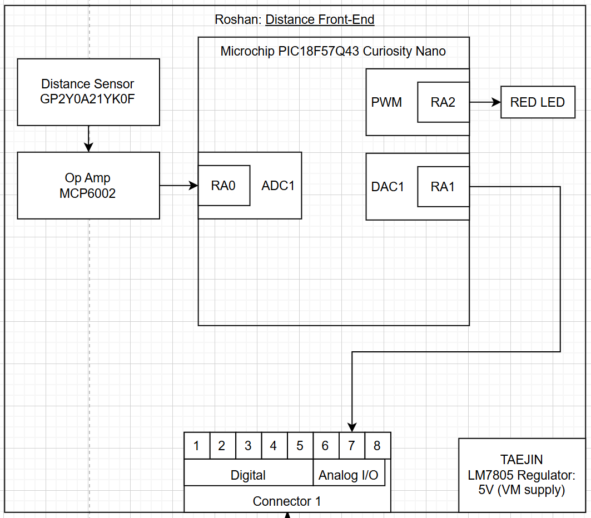

## Overview
Below is the individual block diagram for the Distance Front End of the overall board. This board receives the distance input and adjusts the potentiometer to dim or brighten an LED.

## Block Diagram 

Each block in the Distance Front-End subsystem supports a specific requirement of the team’s product. The GP2Y0A21YK0F distance sensor provides the raw environmental measurement by outputting a voltage proportional to object distance, fulfilling the requirement for real-time sensing. Its output is conditioned by the MCP6002 op-amp, which ensures the signal remains within a clean and usable 0–5 V range for the microcontroller’s ADC. Inside the PIC18F57Q43 Curiosity Nano, the RA0/ADC1 module digitizes this signal so the firmware can interpret distance changes, while the PWM output on RA2 drives the status LED to visually represent those changes. The optional DAC output on RA1 supports debugging and calibration, ensuring the subsystem remains maintainable and test-ready. These blocks collectively implement the required sensing, conditioning, and processing functions that allow the system to interpret and respond to environmental input.

The remaining elements of the block diagram ensure the subsystem operates reliably and integrates cleanly with the broader team system. The LM7805 voltage regulator provides a stable 5 V rail from the 9 V power input, meeting the requirement for safe and consistent subsystem power. The connector interface exposes both analog and digital signals, allowing the processed data and outputs to be shared with the Hub or other boards while maintaining subsystem modularity. Lastly, the PWM-driven red LED offers immediate visual feedback, enabling users and teammates to verify operation at a glance. Together, these blocks form a functional and well-structured signal chain that satisfies the team’s product requirements for sensing accuracy, stable operation, subsystem communication, and clear user feedback.
