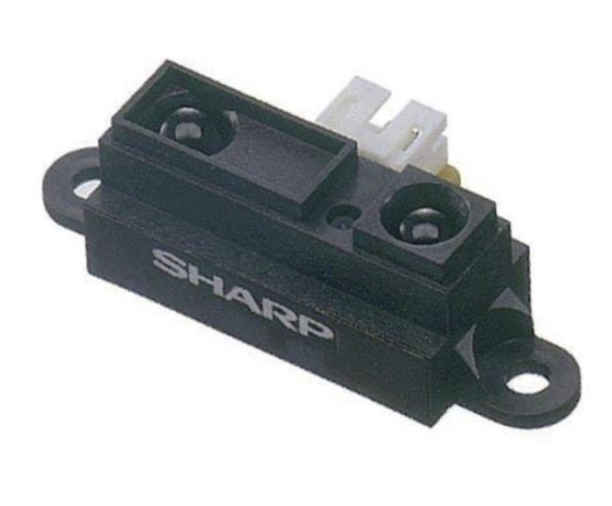
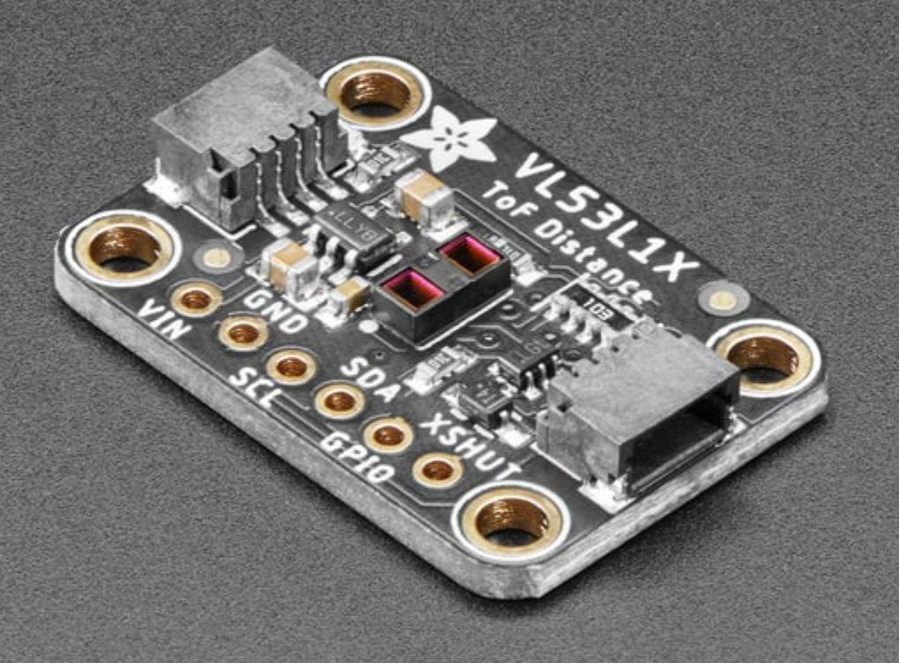

## Voltage Regulator Module

| **Solution**                                                                                                                                                                                      | **Pros**                                                                                                                                    | **Cons**                                                                                            |
| ------------------------------------------------------------------------------------------------------------------------------------------------------------------------------------------------- | ------------------------------------------------------------------------------------------------------------------------------------------- | --------------------------------------------------------------------------------------------------- |
|   TI LM7805CT/NOPB $0.75/each [Link to product](https://www.digikey.at/en/products/detail/texas-instruments/LM7805CT-NOPB/3901929?srsltid=AfmBOopTMflYUGFDdDmnUsD8TNz4yrmp66EBxTwRtfcOCVvsSaKWJ1qR)                 | \* Easy to heatsink \* Compatible with PSoC \* Up to 1–1.5 A                                               | \* Higher dropout (~2 V); can run hot → bigger thermal budget |
|   Microchip MCP1825S-5002E/DB   $0.70/each   [Link to product](https://www.digikey.com/en/products/detail/microchip-technology/MCP1825S-5002E-DB/1636099?) | \* 500 mA LDO  \* lower dropout than 7805   \* compact SOT-223 package | * SMD reflow/soldering skill needed  \* less tolerant of big thermal loads                                                         |
|   AMS1117-5.0 $0.13/each [Link to product](https://www.digikey.com/en/products/detail/evvo/AMS1117-5-0/24370130?)                 | \* 1 A rating \* Compact                                                | \* Moderate dropout (~1.1–1.3 V)  \* Current higher than some LDOs  \* Dip in quality|

**Choice:** LM7805CT/NOPB

**Rationale:** Meets the project’s 500 mA requirement and compatible with the PSoC. Same voltage regulator as the rest of the group so consistency maintained as well.

## Op-Amp Module

| **Solution**                                                                                                                                                                                      | **Pros**                                                                                                                                    | **Cons**                                                                                            |
| ------------------------------------------------------------------------------------------------------------------------------------------------------------------------------------------------- | ------------------------------------------------------------------------------------------------------------------------------------------- | --------------------------------------------------------------------------------------------------- |
|   TI LM358 $0.50/each [Link to product](https://www.digikey.com/en/product-highlight/t/texas-instruments/lm358-dual-operational-amplifiers?)                 | \* Dual amp; single-supply 5 V operation \* Tolerant of inputs near ground| \* Not rail-to-rail in/out \* Input bias & offset higher than modern CMOS parts|
|   MCP6002-E/P   $0.60/each   [Link to product](https://www.digikey.com/en/products/detail/microchip-technology/MCP6002-E-P/683196?) | \* Rail-to-rail I/O  \* Great at 5 V or 3.3 V   \* Good for sensor buffering | * Lower GBW (1 MHz) may limit high-speed filtering                                                         |
|   TLV2372IDR $1.45/each [Link to product](https://www.digikey.com/en/products/detail/texas-instruments/TLV2372IDR/381216?)                 | \* Rail-to-rail \* 3 MHz GBW; more headroom \* low power per channel                                               | \* Higher cost  \* SOIC/T&R variants may require SMD rework skills|

**Choice:** MCP6002

**Rationale:** For an ambient-light signal into the PIC’s ADC, rail-to-rail I/O, low power, and clean operation at 5 V are more valuable than bandwidth. MCP6002 gives simpler headroom management than LM358 with minimal cost increase.

## Distance Sensor Module

| **Solution**                                                                                                                                                                                      | **Pros**                                                                                                                                    | **Cons**                                                                                            |
| ------------------------------------------------------------------------------------------------------------------------------------------------------------------------------------------------- | ------------------------------------------------------------------------------------------------------------------------------------------- | --------------------------------------------------------------------------------------------------- |
|  GP2Y0A21YK0F $12.41/each [Link to product](https://www.mouser.com/ProductDetail/Sharp-Microelectronics/GP2Y0A21YK0F?qs=5S%2F4hkdqNNcI0gpWLEuQ8w%3D%3D&srsltid=AfmBOor6tRQwArriCsBX9USd7xWGLUOvLn5iKQPQR_6T8RsckpvSWZ2-)                 | \* 10–80 cm analog IR distance sensing  \* 5 V supply compatible with system rail \* Simple 3-wire hookup (Vcc, Out, GND)| \* Non-linear analog output curve \* Accuracy ±10% typical \* Sensitive to color/surface reflectivity|
|   HC-SR04 Ultrasonic Module  $5.25/each   [Link to product](https://www.sparkfun.com/ultrasonic-distance-sensor-hc-sr04.html) | \* 2 – 400 cm range \* Low  cost and 5 volts \* Easy firmware via trigger/echo timing | * Requires two I/O pins \* Unreliable on soft/angled targets \* Bulkier than IR sensor                                                         |
|   Adafruit VL53L1X Time of Flight Distance Sensor - ~30 to 4000mm - STEMMA QT / Qwiic $14.95/each [Link to product](https://www.adafruit.com/product/3967)                 | \* 4 m max range \* High precision and narrow field of view \* I²C digital output with built-in filtering                                               | \* Needs 3.3 V rail + level shifting \* More complex firmware (I²C driver)|

**Choice:** Sharp GP2Y0A21YK0F

**Rationale:** Operates directly from the 5 V rail and outputs an analog voltage enough for the PIC ADC, eliminating extra signal-conditioning hardware. It covers the intended 10–80 cm detection zone with low power draw and minimal code overhead, ideal for quick integration into the Distance Front End.

## Final Component Summary

| **Component Category**           | **Component Name**         | **Part Number**    | **Description / Purpose**                                                                 |
| -------------------------------- | -------------------------- | ------------------ | ----------------------------------------------------------------------------------------- |
| **Microcontroller**              | PIC18F57Q43 Curiosity Nano | DM182029           | Reads amplified distance sensor signal (RA0), drives PWM LED, provides subsystem control. |
| **Distance Sensor**              | Sharp IR Distance Sensor   | GP2Y0A21YK0F       | Outputs analog voltage proportional to distance (10–80 cm range).                         |
| **Op-Amp (Signal Conditioning)** | Dual Op-Amp                | MCP6002            | Conditions and amplifies the sensor output before feeding the PIC ADC.                    |
| **Voltage Regulator**            | 5 V Linear Regulator       | LM7805             | Converts 9 V barrel jack input to regulated 5 V for the subsystem.                        |
| **Indicator Output**             | Red Status LED (PWM)       | Broadcom HLMP-4700 | Visual distance indicator driven by PWM from PIC.                                         |

## Pinout

| **Location** | **Pin Name** | **Module** | **Function**                                  | **Direction** | **Custom Name** | **Analog** |
| ------------ | ------------ | ---------- | --------------------------------------------- | ------------- | --------------- | ---------- |
| **21**       | RA0          | ADCC       | ANx (ADC Input)                               | input         | IO_RA0          | Yes         |
| **22**       | RA1          | Pins       | GPIO (LED PWM Output)                         | output        | IO_RA1          | No          |
| **23**       | RA2          | DAC1       | DAC1OUTx (Optional analog output / debugging) | output        | IO_RA2          | Yes         |
