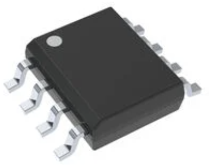

## Voltage Regulator Module

| **Solution**                                                                                                                                                                                      | **Pros**                                                                                                                                    | **Cons**                                                                                            |
| ------------------------------------------------------------------------------------------------------------------------------------------------------------------------------------------------- | ------------------------------------------------------------------------------------------------------------------------------------------- | --------------------------------------------------------------------------------------------------- |
|   TI LM7805CT/NOPB $0.75/each [Link to product](https://www.digikey.at/en/products/detail/texas-instruments/LM7805CT-NOPB/3901929?srsltid=AfmBOopTMflYUGFDdDmnUsD8TNz4yrmp66EBxTwRtfcOCVvsSaKWJ1qR)                 | \* Easy to heatsink \* Compatible with PSoC \* Up to 1–1.5 A                                               | \* Higher dropout (~2 V); can run hot → bigger thermal budget |
|   Microchip MCP1825S-5002E/DB   $0.70/each   [Link to product](https://www.digikey.com/en/products/detail/microchip-technology/MCP1825S-5002E-DB/1636099?) | \* 500 mA LDO  \* lower dropout than 7805   \* compact SOT-223 package | * SMD reflow/soldering skill needed  \* less tolerant of big thermal loads                                                         |
|   AMS1117-5.0 $0.13/each [Link to product](https://www.digikey.com/en/products/detail/evvo/AMS1117-5-0/24370130?)                 | \* 1 A rating \* Compact                                                | \* Moderate dropout (~1.1–1.3 V)  \* Current higher than some LDOs  \* Dip in quality|

**Choice:** MCP1825S-5002

**Rationale:** Meets the project’s 500 mA requirement with lower dropout than a 7805, reducing heat when input headroom is small; SOT-223 footprint keeps the PCB compact while still manageable to solder. Price and availability are also solid.

## Op-Amp Module

| **Solution**                                                                                                                                                                                      | **Pros**                                                                                                                                    | **Cons**                                                                                            |
| ------------------------------------------------------------------------------------------------------------------------------------------------------------------------------------------------- | ------------------------------------------------------------------------------------------------------------------------------------------- | --------------------------------------------------------------------------------------------------- |
|   TI LM358 $0.50/each [Link to product](https://www.digikey.com/en/product-highlight/t/texas-instruments/lm358-dual-operational-amplifiers?)                 | \* Dual amp; single-supply 5 V operation \* Tolerant of inputs near ground| \* Not rail-to-rail in/out \* Input bias & offset higher than modern CMOS parts|
|   MCP6002-E/P   $0.60/each   [Link to product](https://www.digikey.com/en/products/detail/microchip-technology/MCP6002-E-P/683196?) | \* Rail-to-rail I/O  \* Great at 5 V or 3.3 V   \* Good for sensor buffering | * Lower GBW (1 MHz) may limit high-speed filtering                                                         |
|   TLV2372IDR $1.45/each [Link to product](https://www.digikey.com/en/products/detail/texas-instruments/TLV2372IDR/381216?)                 | \* Rail-to-rail \* 3 MHz GBW; more headroom \* low power per channel                                               | \* Higher cost  \* SOIC/T&R variants may require SMD rework skills|

**Choice:** MCP6002

**Rationale:** For an ambient-light signal into the PIC’s ADC, rail-to-rail I/O, low power, and clean operation at 5 V are more valuable than bandwidth. MCP6002 gives simpler headroom management than LM358 with minimal cost increase.

## Light Sensor Module

| **Solution**                                                                                                                                                                                      | **Pros**                                                                                                                                    | **Cons**                                                                                            |
| ------------------------------------------------------------------------------------------------------------------------------------------------------------------------------------------------- | ------------------------------------------------------------------------------------------------------------------------------------------- | --------------------------------------------------------------------------------------------------- |
|   TEMT6000X01 $0.90/each [Link to product](https://www.mouser.com/ProductDetail/Vishay-Semiconductors/TEMT6000X01?qs=%2Fjqivxn91ccZGXDwz0wGxg%3D%3D&srsltid=AfmBOooQdB74AbB3cmws8rrGCeFrnCZulZ_kDPwcyoM4WwAIF_F-DG09)                 | \* Simple analog output \* Fast response and tiny footprint  \* Works directly with op-amp/ADC| \* Output is non-linear vs. lux \* Requires biasing and calibration  \* Sensitive to angle/spectrum|
|   BH1750FVI   $4.00/each   [Link to product](https://www.sunrom.com/p/digital-light-sensor-bh1750fvi?) | \* Reports lux directly via I²C  \* Minimal analog design | * Requires I²C + library  \* Fixed spectrum/transfer function  \* Module size > bare sensor                                                         |
|   Adafruit VEML7700 Lux Sensor - I2C Light Sensor - STEMMA QT / Qwiic $5.00/each [Link to product](https://www.adafruit.com/product/4162?srsltid=AfmBOorBHSPB9NFLJcU5ez7-J4arau8XeTmrqw6rngzxuV2-He8xyOAv)                 | \* Wide 0–120 klux, 16-bit  \* adjustable gain/integration  \* 3.3/5 V friendly and accurate lux output                                               | \* I²C interface required|

**Choice:** TEMT6000

**Rationale:** Since there is already an ADC channel, TEMT6000 keeps BOM cost and firmware complexity low while providing fast analog response. If calibrated, it’s sufficient for relative brightness feedback to the LED driver.
