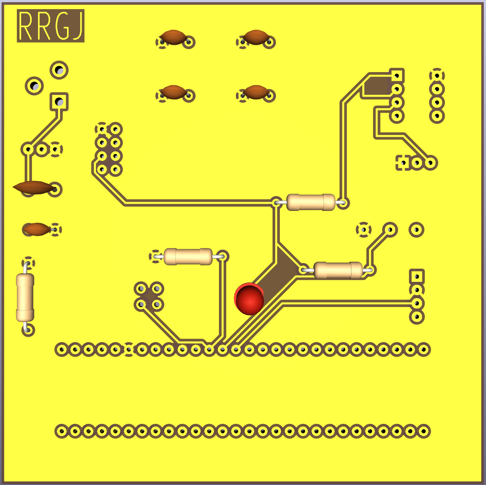
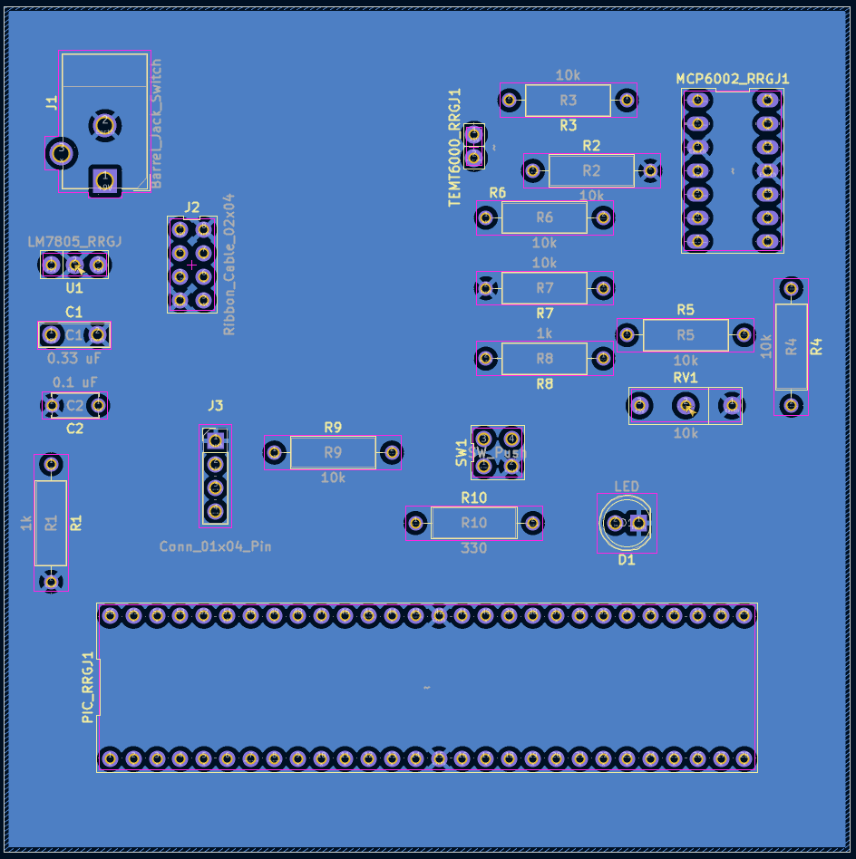
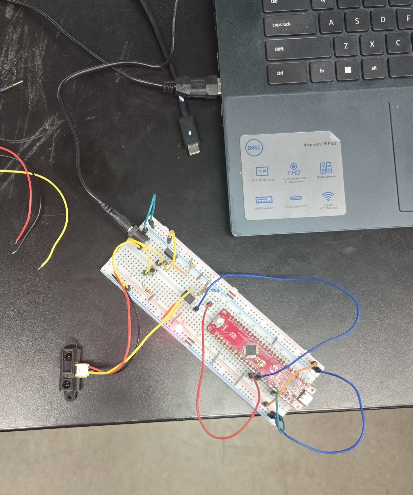
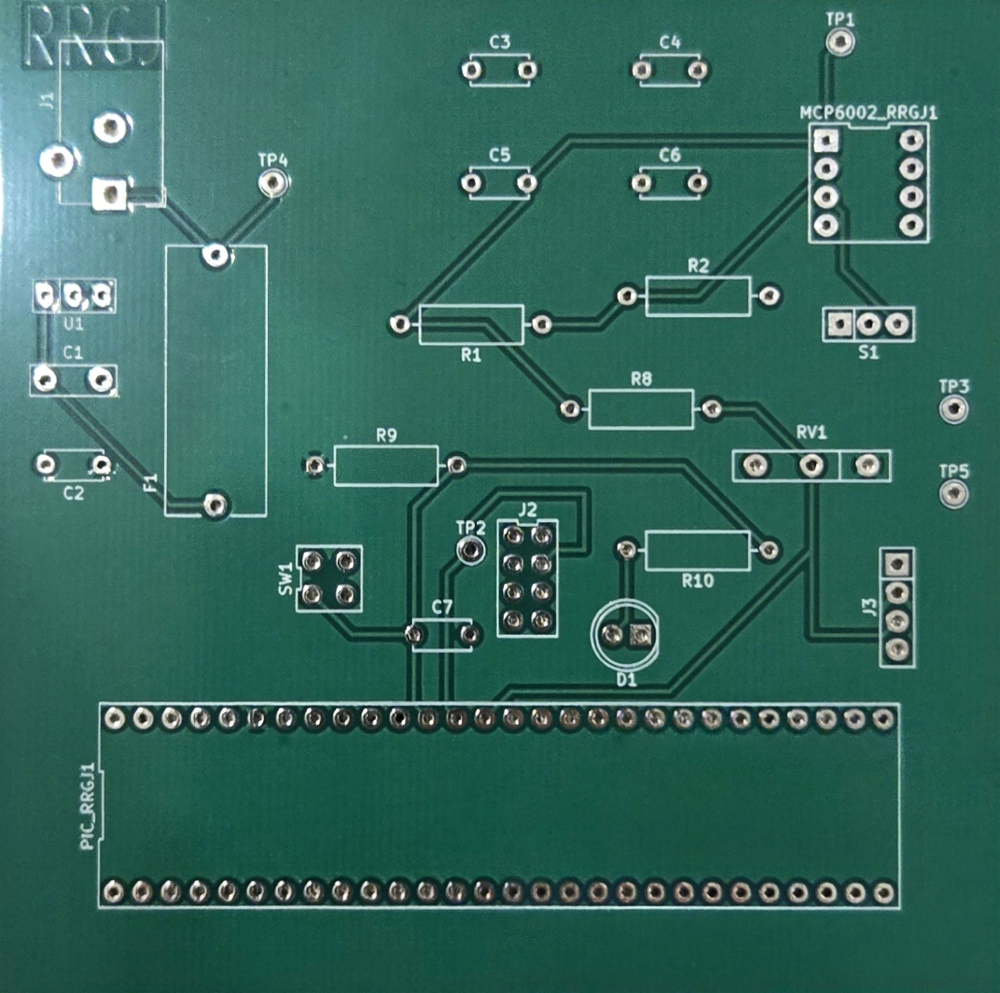

## Front and Back of PCB Layout

### Front

### Back

### Working Breadboard

### PCB

The front and back as a PDF is available [*here*](FrontAndBack.pdf), and the Zip folder of the project [*here*](https://github.com/roshanroy-r64x/roshanroy-r64x.github.io/blob/main/docs/04-Schematic/Subsystem.zip).